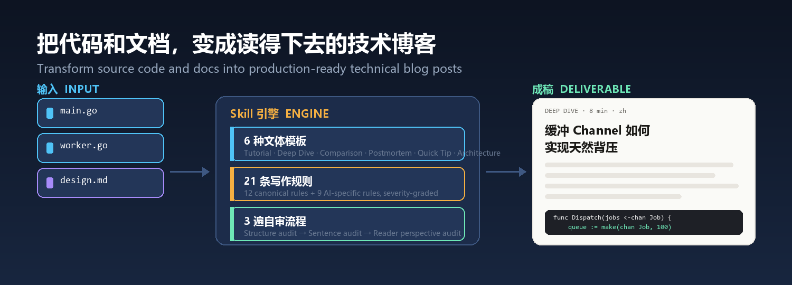

<div align="center">



**Transform source code and docs into production-ready technical blog posts**

[](LICENSE)
[](SKILL.md)
[](https://github.com/YardonYan/tech-blog-generator)
[](#quick-start)
[](#21-writing-rules)
[](#6-genres)

[中文](README.md) · **English**

</div>

---

> Hand it your code files and reference docs, and it returns a structured, evidence-backed, zero-fluff technical blog post — in English or Chinese.

It doesn't just "generate an article". It emulates a senior staff engineer's writing process: analyse the code's architecture first, pick the most appropriate genre, write under 21 strict rules, then run three self-audit passes before delivering.

## Table of Contents

- [What This Is](#what-this-is)
- [Quick Start](#quick-start)
- [Ways to use it](#ways-to-use-it)
- [Key Features](#key-features)
- [6 Genres](#6-genres)
- [21 Writing Rules](#21-writing-rules)
- [Chinese Writing Mode](#chinese-writing-mode)
- [3-Pass Self-Audit](#3-pass-self-audit)
- [Pitfalls Across 10 Languages](#pitfalls-across-10-languages)
- [What It Avoids](#what-it-avoids)
- [Project Structure](#project-structure)
- [Example](#example)
- [Troubleshooting](#troubleshooting)
- [Credits](#credits)
- [License](#license)

---

<a id="what-this-is"></a>

## What This Is

`tech-blog-generator` is a Skill package for AI agents. Hand it code files and reference docs, and it returns a structured, evidence-backed, zero-fluff technical blog post.

The writing process has three stages:

1. **Analyse the architecture** — read the code's structure, key decisions and constraints
2. **Pick a genre** — choose the best fit from 6 templates (Tutorial / Deep Dive / Comparison / Postmortem / Quick Tip / Architecture Overview)
3. **Write under the rules, then self-audit** — 21 writing rules constrain the prose, and three audit passes (structure / sentence / reader perspective) must all pass before delivery

<a id="quick-start"></a>

## Quick Start

### Using the installer (recommended)

The repo ships a zero-dependency installer that copies the skill into the skills directory of each AI app on your machine:

```bash
node tools/install.mjs --list                 # list available targets
node tools/install.mjs --ai workbuddy         # install into WorkBuddy
node tools/install.mjs --ai all               # every target
node tools/install.mjs --ai all --dry-run     # preview only, writes nothing
```

Targets verified to exist on a real machine: WorkBuddy, TRAE China edition, CodeBuddy, Claude Code, Codex CLI, OpenClaw, Qwen Code, cc-switch.

### Installing as a plugin (WorkBuddy / CodeBuddy / Claude Code)

The repository root carries `.codebuddy-plugin/` and `.claude-plugin/` manifests, so it can be registered directly as a single-plugin marketplace and installed as a plugin rather than by copying directories.

The field names and values follow the manifests shipped inside the apps themselves — this is not a format of my own invention. **The file format was checked field by field against the apps' own bundled marketplaces; the end-to-end register-and-load flow has not been verified.** Where you register it depends on the version you have.

Regenerate the manifests after changing the `name` or version in `SKILL.md`:

```bash
node tools/build_plugins.mjs .
```

### Manual installation

```bash
git clone https://github.com/YardonYan/tech-blog-generator.git ~/.qclaw/skills/tech-blog-generator
```

Once installed, upload your code files in a conversation and say "write a blog" or "写一篇技术博客".

### Trigger keywords

| English | Chinese |
|---------|---------|
| write a blog, generate tutorial, explain code | 写博客、写教程、代码讲解、生成文档 |
| deep dive, architecture overview, write a postmortem | 深度解析、架构概览、复盘报告、技术分享 |
| create documentation, code review blog | 源码分析、设计文档、技术写作 |

### Supported file types

| Type | Extensions |
|------|------------|
| Code | `.py` `.go` `.java` `.js` `.ts` `.jsx` `.tsx` `.rs` `.cpp` `.cs` `.kt` `.swift` |
| Docs | `.md` `.pdf` `.txt` `.yaml` `.dockerfile` |

<a id="key-features"></a>

## Ways to use it

How you install this depends on which AI assistant you use. Installing into several on the same machine is fine — they do not conflict.

### One command, any assistant

The repo ships a zero-dependency installer, so there is no manual directory copying:

```bash
git clone https://github.com/YardonYan/tech-blog-generator.git
cd tech-blog-generator
node tools/install.mjs --list          # list the targets available on this machine
node tools/install.mjs --ai workbuddy  # install into one
node tools/install.mjs --ai all        # install into all of them
```

### Mainland China tools

| Target id | Assistant | Global directory | Per-project directory |
| --- | --- | --- | --- |
| `workbuddy` | WorkBuddy | `~/.workbuddy/skills` | `.workbuddy/skills` |
| `codebuddy` | CodeBuddy | `~/.codebuddy/skills` | `.codebuddy/skills` |
| `trae-cn` | TRAE China edition | `~/.trae-cn/skills` | `.trae-cn/skills` |
| `qoder` | Qoder | `~/.qoder-cn/skills` | `.qoder/skills` |
| `qwen` | Qwen Code | `~/.qwen/skills` | `.qwen/skills` |
| `openclaw` | OpenClaw | `~/.openclaw/workspace/skills` | `.openclaw/skills` |
| `cc-switch` | cc-switch | `~/.cc-switch/skills` | `.cc-switch/skills` |

Qoder needs `/skills reload` or a session restart before it picks the skill up. OpenClaw additionally has a skill marketplace, SkillHub (Tencent Cloud hosted, `openclaw skill install <slug>`), reachable directly from mainland China.

### Elsewhere

| Target id | Assistant | Global directory | Per-project directory |
| --- | --- | --- | --- |
| `claude` | Claude Code | `~/.claude/skills` | `.claude/skills` |
| `codex` | Codex CLI | `~/.codex/skills` | `.codex/skills` |
| `cursor` | Cursor | `~/.cursor/skills` | `.cursor/skills` |
| `agents` | Generic agent standard | `~/.agents/skills` | `.agents/skills` |

These normally require access to international networks when used from mainland China.

Without a flag it installs globally (available to every project); add `--project` to install into relative directories inside the current project, which suits committing it alongside the code.

### Network notes for mainland China

The installer only reads and writes local files — it makes no network calls. What network conditions actually affect is the demo pages and external assets:

| Item | Situation |
| --- | --- |
| 本仓脚本 | all three scripts use only the Python standard library — no packages, no network |

### Installing as a plugin

The repository root carries four sets of plugin manifests, so a supporting assistant can install it directly instead of copying directories:

| Assistant | Manifest | How |
| --- | --- | --- |
| WorkBuddy / CodeBuddy | `.codebuddy-plugin/` | Add this repository path or URL under marketplace settings |
| Claude Code | `.claude-plugin/` | `/plugin marketplace add YardonYan/tech-blog-generator` then `/plugin install tech-blog-generator@YardonYan-tech-blog-generator` |
| Codex | `.codex-plugin/` | Follow Codex's plugin install flow, pointing at this repository |
| Cursor | `.cursor-plugin/` | `/add-plugin`, or search the plugin marketplace |

The field names and values follow the manifests shipped inside each assistant — this is not a format of my own invention. **The manifest files were checked field by field; the register-and-load flow has not been verified end to end.** Where you register it depends on the version you have.

### Where it does not apply

A few environments get asked about but have no mechanism for this. Listed here so nobody wastes time:

| Environment | Situation |
| --- | --- |
| Browser IDEs (CodeSandbox, StackBlitz, Replit) | A skill is an instruction file for an AI assistant, not a runnable app — these environments have no entry point for loading one |
| Cloud shells (Google Cloud Shell, AWS CloudShell) | Same as above. If you only want to run the repo's scripts, `git clone` and run the documented commands; that is unrelated to skill loading |
| Uploading the repository ZIP to an assistant's skill upload dialog | The repo includes references and scripts, which may exceed file-count limits; the installer or a plugin marketplace is more reliable |
| Mobile | The assistants above have no meaningful mobile client |

---

## Key Features

| Feature | Description |
|---------|-------------|
| **21 writing rules** | 12 canonical authorities (Strunk & White, Orwell, Pinker, Gopen & Swan) + 9 AI-specific rules, each with a severity level and BAD→GOOD examples |
| **6 genre templates** | Tutorial, Deep Dive, Comparison, Postmortem, Quick Tip, Architecture Overview |
| **Chinese writing mode** | Full Chinese technical-writing rules: buzzword blocklist (20+ terms), sentence-level prohibitions, TL;DR three-part structure |
| **Mandatory concrete anchors** | Every paragraph must carry a checkable proper noun, number, quote or decision — flagged in self-audit when missing |
| **Pitfalls across 10 languages** | Common errors in Go, Python, JS/TS, Java, Rust, C++, C#, Kotlin, Swift and Docker/K8s |
| **3-pass self-audit** | Structure audit, sentence audit, reader-perspective audit — all must pass before delivery |
| **Citation discipline** | Every claim about performance, behaviour or design must be backed by a name, a number or a file reference |
| **ASCII / Mermaid diagrams** | Automatically generates architecture diagrams, data-flow charts and sequence diagrams for abstract concepts |

<a id="6-genres"></a>

## 6 Genres

| Genre | When to use | Tone |
|-------|-------------|------|
| **Tutorial** | Step-by-step implementation teaching | A peer pointing the way, never lecturing |
| **Deep Dive** | Thorough analysis of one concept or mechanism | Analytical, precise |
| **Comparison** | Side-by-side evaluation of options or technologies | Neutral, evidence-driven |
| **Postmortem** | Incident or project retrospective | Fact-oriented, no blame |
| **Quick Tip** | A single technique or pattern | Short, immediately usable |
| **Architecture Overview** | System design documentation | Systems thinking, focused on decisions |

<a id="21-writing-rules"></a>

## 21 Writing Rules

The rule set has two parts: 12 canonical rules (from Strunk & White, Orwell, Pinker, Gopen & Swan) and 9 AI-specific rules observed in the field across LLM output from 2022 to 2026.

Each rule carries a severity level:

- **Critical** — if violated, the reader cannot trust the text
- **High** — a visible AI tell or a failure of clarity
- **Medium** — a local readability cost

The most critical ones:

| # | Rule | Severity |
|---|------|----------|
| 01 | Curse of Knowledge: don't assume the reader shares your tacit knowledge | Critical |
| H | Citation Discipline: every claim must be backed by evidence | Critical |
| 03 | Concrete over Abstract: replace category words with specific items | High |
| 04 | Cut Needless Words: "in order to" → "to", "due to the fact that" → "because" | High |

Full list of 21 rules: [`references/writing_rules.md`](references/writing_rules.md).

<a id="chinese-writing-mode"></a>

## Chinese Writing Mode

Chinese mode activates automatically when the user asks for Chinese output or supplies Chinese source material. It includes:

- **Buzzword blocklist** (20+ terms, each with a concrete replacement direction): 生态 → list the actual dependency relationships; 赋能 → let users do X; 闭环 → A is followed by B; 抓手 → the variable we can actually change is X
- **Conclusion-grabbing words banned**: 很清楚、说明了、显然、真正、自然会
- **Antithetical syntax banned**: "不是……而是……", "不在……而在……"
- **Presenter voice removed**: "聊到这里", "先把 X 单独拿出来说", "这张图想说明的事情很简单" — delete outright, don't rephrase
- **Empty evaluations replaced**: "很顺" → state the specific constraint

Full Chinese rules: [`references/chinese_writing.md`](references/chinese_writing.md).

<a id="3-pass-self-audit"></a>

## 3-Pass Self-Audit

| Pass | What it checks |
|------|----------------|
| **Pass 1: structure audit** | Does the opening state the problem being solved? Does every section have a clear purpose? Does the conclusion echo the opening? |
| **Pass 2: sentence audit** | Sweep out 26 banned phrase patterns; check concrete anchors (at least one verifiable detail per paragraph); check for passive-voice abuse; check that every code block has a file reference and an explanation |
| **Pass 3: reader perspective** | Could someone who has never seen the codebase follow along? Would a senior engineer feel lectured at? Could a reader with two minutes grab the point? |

Full checklist: [`references/self_review_checklist.md`](references/self_review_checklist.md).

<a id="pitfalls-across-10-languages"></a>

## Pitfalls Across 10 Languages

Covers common errors in Go, Python, JS/TS, Java, Rust, C++, C#, Kotlin, Swift and Docker/K8s, each organised as symptom → root cause → fix.

Full table: [`references/common_pitfalls.md`](references/common_pitfalls.md).

---

<a id="what-it-avoids"></a>

## What It Avoids

| Avoids this | Does this instead |
|-------------|-------------------|
| Teaching voice ("let's learn", "beginners please note") | Peer-to-peer tone, equal and direct |
| AI filler ("unlock the power of", "in today's digital age") | Gets to the point; every sentence carries information |
| Unexplained code blocks | Every code block carries its file location plus what it does, why, its inputs and outputs, and the pitfalls |
| Vague descriptors ("efficient", "robust") | Specific numbers and mechanism explanations |
| Fake specificity (made-up percentages, invented names) | Better to omit a number than to invent one |
| Customer-service voice ("Great question!", "Hope this helps") | Stops when the answer ends; no ceremonial sign-off |
| Chinese buzzwords (闭环、赋能、抓手、落地) | Concrete actions, objects and constraints |

---

<a id="project-structure"></a>

## Project Structure

```
tech-blog-generator/
├── SKILL.md                         # Core AI instructions (21 rules, 6 genres, 3-pass audit)
├── .codebuddy-plugin/              Plugin manifests (WorkBuddy / CodeBuddy)
├── .codex-plugin/                  Plugin manifest (Codex)
├── .cursor-plugin/                 Plugin manifest (Cursor)
├── .claude-plugin/                 Plugin manifests (Claude Code)
├── README.md                        # Chinese README
├── README.en.md                     # English README (this file)
├── LICENSE                          # Apache-2.0 licence
├── assets/
│   └── hero.png                     # README hero image
├── tools/
│   ├── gen_readme_images.py         # Generates README images (Pillow)
│   └── build_plugins.mjs            # Generates plugin manifests
├── agents/
│   └── openai.yaml                  # UI metadata
├── docs/
│   └── backfill.md                  # Archive: source-material backfill notes
├── references/
│   ├── writing_rules.md             # Full 21 rules with BAD→GOOD examples
│   ├── style_guide.md               # Banned phrases and anti-patterns
│   ├── common_pitfalls.md           # Quick reference for 10 languages
│   ├── chinese_writing.md           # Chinese technical writing rules + buzzword blocklist
│   ├── blog_templates.md            # Structural templates for the 6 genres
│   └── self_review_checklist.md     # 3-pass audit checklist
└── scripts/
    ├── validate_yaml.py             # Frontmatter validation
    ├── count_tokens.py              # Token estimation
    └── review_draft.py              # Automated style checking
```

---

<a id="example"></a>

## Example

**Input**:

> Here are `main.go` and `worker.go` — write a deep dive on the concurrency model.

**Output**:

````markdown
---
title: "Go Worker Pools: How a Buffered Channel Gives You Backpressure for Free"
description: "A line-by-line walkthrough of our worker pool, showing how a bounded channel provides flow control without any external component."
tags: [go, concurrency, worker-pool, channels]
language: en
genre: deep-dive
---

## The problem

Production p95 latency went from 120ms to 450ms. The cause was an unbounded number of goroutines...

## Architecture

[ASCII diagram: job dispatch → buffered channel → worker pool]

## Code walkthrough

File: main.go:32-58
```go
func Dispatch(jobs <-chan Job, workers int) { ... }
```
What it does: builds a worker pool over a channel with capacity 100...
Why it's designed this way: once the channel fills, Dispatch blocks automatically → the dispatch rate cannot exceed the processing rate → backpressure for free.
Inputs: `<-chan Job` (the upstream job stream), `workers int` (concurrency)
Outputs: none; results are written to a result channel via a closure
Pitfall: too high a capacity (say 10000) hides the worker bottleneck; 100 makes the backpressure visible within seconds

## Common pitfalls

| Symptom | Root cause | Fix |
|:---|:---|:---|
| `all goroutines asleep` | Unbuffered channel with no receiver | Add a buffer or guarantee a receiver |
| `concurrent map write` | Concurrent map writes without a lock | Use sync.RWMutex |
````

---

<a id="troubleshooting"></a>

## Troubleshooting

### Installed, but the skill never fires

Check three things, in order:

1. **Is `SKILL.md` at the top level of the skill directory?** The correct shape is `<app-skills-dir>/tech-blog-generator/SKILL.md`. An early version of this skill nested `SKILL.md` inside a same-named subdirectory, which stopped apps from finding it — if you are on an older copy, check the directory layout first.
2. **Restart the app.** Most apps scan the skills directory only at startup.
3. **Is that the directory the app actually scans?** Run `node tools/install.mjs --list`.

### A script reports `❌ File not found: --help`

None of the three scripts supports `--help`; the first argument is always treated as a file path. To learn the usage, read the docstring at the top of the source, or just pass a file:

```bash
python scripts/count_tokens.py path/to/draft.md
python scripts/validate_yaml.py path/to/draft.md
python scripts/review_draft.py path/to/draft.md
```

### `validate_yaml.py` reports `❌ Missing frontmatter start '---'`

The draft has no YAML frontmatter. Every article the skill produces starts with one, and without it there is nothing to validate:

```yaml
---
title: "Article title"
description: "One-line summary"
tags: [go, concurrency]
language: en
genre: deep-dive
---
```

Another common message is `description should include 'Use when' and 'NOT for'` — that is a convention for the skill's own description (stating when it applies and when it does not). Draft articles can ignore it.

### `review_draft.py` reports a pile of issues but exits with code 0

It is an advisory tool, not a gate. The exit code is always 0; what matters is the issue count in the output, and the script draws its own conclusion (for example `🔴 High issue count — consider rewriting sections`). To use it as a CI gate you would have to parse the output yourself.

### It reports `some code blocks lack file references`

That is Rule H (citation discipline) at work: every code block should state its file location, otherwise the reader has no way to verify it. Add a marker such as `File: main.go:32-58`.

### The scripts will not run / Python is not found

All three scripts use only the Python standard library (`re`, `sys`, `pathlib`, `collections`) — no third-party packages, no network access. Python 3 is required:

```bash
python3 --version
```

On Windows, if `python` does not resolve, try `py -3`.

---

<a id="credits"></a>

## Credits

This project's writing rule system and design philosophy are deeply influenced by the following open-source projects:

| Project | Author | Contribution |
|---------|--------|--------------|
| **agent-style** | [yzhao062](https://github.com/yzhao062) | The 21-rule severity-graded framework, BAD→GOOD examples |
| **WRITING.md** | [Anbeeld](https://github.com/Anbeeld) | The concrete-anchor system, fake-specificity guards, self-audit workflow |
| **technical-writing** | [luoling8192](https://github.com/luoling8192) | Chinese technical writing rules, buzzword blocklist, few-shot corrections |
| **technical-writing-template** | [BolajiAyodeji](https://github.com/BolajiAyodeji) | Blog structure template standardisation |

**Canonical writing authorities**: Strunk & White (*The Elements of Style*), George Orwell (*Politics and the English Language*), Steven Pinker (*The Sense of Style*), Gopen & Swan (*The Science of Scientific Writing*)

---

<a id="license"></a>

## License

**Apache-2.0** — free to use, modify, and distribute, provided attribution and the license notice are retained. See [LICENSE](LICENSE) for the full text.

Copyright 2026 YardonYan
